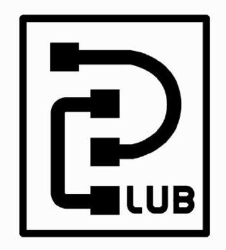
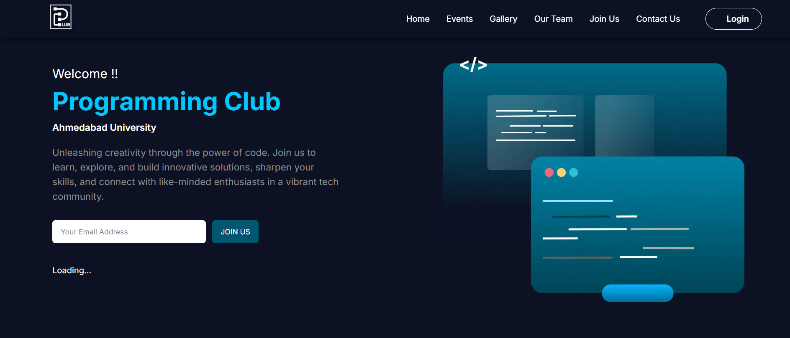
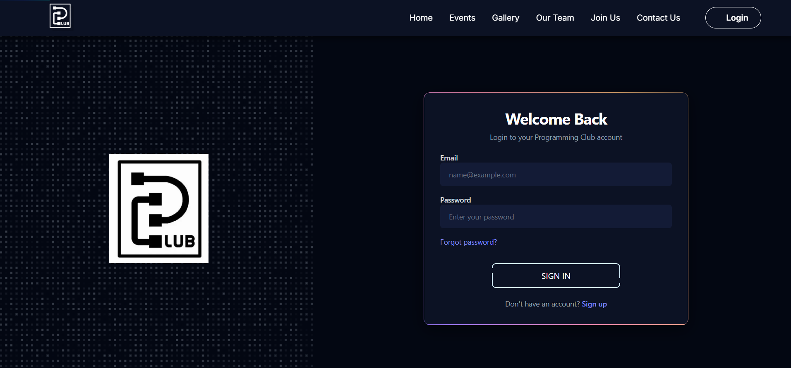

# Programming Club | Ahmedabad University

## Website for Aspiring Coders

<p align="center">
  
  
</p>

##  Project Overview

Welcome to the Programming Club website repository! This project aims to provide a modern and responsive platform for the Programming Club at Ahmedabad University.

**Purpose:** To showcase club activities, events, contact information, and more.

**Audience:** Students, faculty, and prospective members.

##  Screenshots

<p align="center">
  
  
</p>


##  Key Features

- **Engaging Home Page:** A dynamic hero section with club highlights.
- **Event Listings:** Browse upcoming and past events.
- **Detailed Event Pages:** Access event details and registration.
- **Admin Dashboard:** Secure admin interface for event and member management.
- **User Authentication:** User registration and login system.
- **Contact Form:** Easy way for visitors to get in touch.
- **Our Team:** Showcase club members and their roles.
- **Gallery:** Display club activities and achievements.

##  Tech Stack

- **Frontend**
  - Next.js 15 with App Router
  - React 19
  - Tailwind CSS 4
  - Framer Motion for animations
  - lucide-react
  - react-icons
  - styled-components
  - tailwind-merge

- **Backend**
  - Next.js API Routes
  - MongoDB with Mongoose
  - JWT for authentication
  - bcryptjs
  - ioredis
  - jsonwebtoken
  - nodemailer
  - redis

##  Project Structure

```
src/app/
├── admin/
│   └── login/         # Admin authentication
├── past-events/       # Event listings and details
├── users/
│   ├── login/         # User login
│   └── sign-up/       # User registration
├── Components/        # Reusable UI components
└── Client Components/ # Client-side components
├── events/            # Event pages
│   └── [id]/          # Dynamic event pages
├── api/               # API routes
│   ├── auth/          # Authentication routes
│   │   ├── forgot-password/ # Forgot password route
│   │   ├── login/          # Login route
│   │   └── register/       # Register route
│   ├── controllers/   # API controllers
│   ├── lib/           # API library
│   ├── models/        # API models
│   └── otp/           # OTP routes
└── Styles/           # Styles
```

##  Getting Started

### Prerequisites

- Node.js 18+
- npm or yarn
- MongoDB Atlas 

### Installation

1.  Clone the repository:
    ```bash
    git clone https://github.com/PClub-Ahmedabad-University/The-Programming-Club.git
    ```
2.  Navigate to the project directory:
    ```bash
    cd pclub-website
    ```
3.  Install dependencies:
    ```bash
    npm install
    ```
4.  Run the development server:
    ```bash
    npm run dev
    ```

##  Developer Credits
Made with ❤️ by members of the Programming Club:

- [Jay Shah](https://github.com/Jay-1409)
- [Deep Patel](https://github.com/DataWizard1631)
- [Drumil Bhati](https://github.com/drumilbhati)
- [Meet Gandhi](https://github.com/meet-dharmesh-gandhi)
- [Kushal Rathod](https://github.com/KushalXCoder)
- [Subrat Jain](https://github.com/CodexKnight-ai)


<!-- 
## 📧 Contact Information

For support or inquiries, please contact: [email protected] -->
